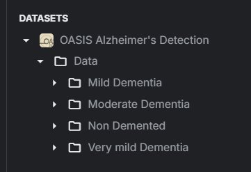
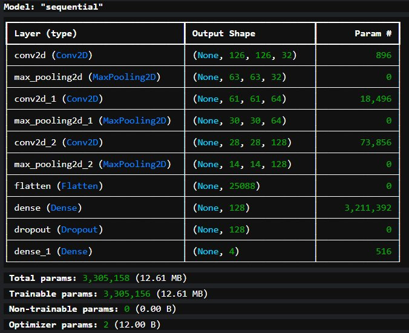
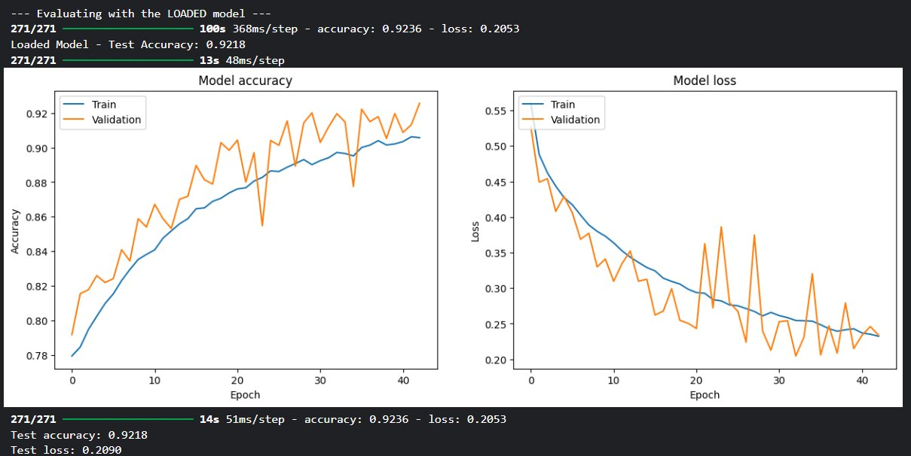
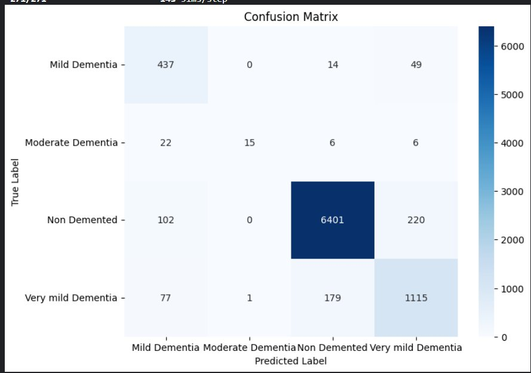

# Alzheimer's Disease Detection using CNN

A deep learning project that classifies brain MRI scans into four stages of Alzheimer's disease using a custom Convolutional Neural Network (CNN) built with TensorFlow/Keras — achieving **92.18% test accuracy**.

---

## 📌 Table of Contents

- [Overview](#overview)
- [Dataset](#dataset)
- [Model Architecture](#model-architecture)
- [Training & Results](#training--results)
- [Confusion Matrix](#confusion-matrix)
- [Tech Stack](#tech-stack)
- [Project Structure](#project-structure)
- [How to Run](#how-to-run)

---

## Overview

Alzheimer's disease is a progressive neurological disorder that causes brain cells to die, leading to memory loss and cognitive decline. Early detection is critical to slowing its progression. This project uses brain MRI images from the **OASIS dataset** to automatically classify scans into one of four dementia severity levels using a CNN.

---

## Dataset

The dataset used is the **OASIS Alzheimer's Detection** dataset, organized into four classes:


https://www.kaggle.com/datasets/ninadaithal/imagesoasis

**Data Split:**
- 🟢 Training: **80%**
- 🟡 Validation: **10%**
- 🔴 Test: **10%**

**Preprocessing & Augmentation (training only):**
- Pixel normalization to `[0, 1]`
- Random rotation (±20°)
- Width & height shifts (10%)
- Shear & zoom transformations (10%)
- Horizontal flipping
- Image resize to `128 × 128`

---

## Model Architecture

A custom Sequential CNN was built from scratch with **3,305,158 trainable parameters**.



| Layer | Output Shape | Parameters |
|---|---|---|
| Conv2D (32 filters, 3×3, ReLU) | (None, 126, 126, 32) | 896 |
| MaxPooling2D | (None, 63, 63, 32) | 0 |
| Conv2D (64 filters, 3×3, ReLU) | (None, 61, 61, 64) | 18,496 |
| MaxPooling2D | (None, 30, 30, 64) | 0 |
| Conv2D (128 filters, 3×3, ReLU) | (None, 28, 28, 128) | 73,856 |
| MaxPooling2D | (None, 14, 14, 128) | 0 |
| Flatten | (None, 25088) | 0 |
| Dense (128, ReLU) | (None, 128) | 3,211,392 |
| Dropout (0.5) | (None, 128) | 0 |
| Dense (4, Softmax) | (None, 4) | 516 |

> **Total params:** 3,305,158 (12.61 MB)  
> **Optimizer:** Adam | **Loss:** Categorical Cross-Entropy  
> **Early Stopping:** Patience = 10, monitoring `val_loss`

---

## Training & Results

The model was trained for **~42 epochs** (with early stopping) and achieved strong generalization on the held-out test set.

| Metric | Value |
|---|---|
| ✅ Test Accuracy | **92.18%** |
| 📉 Test Loss | **0.2090** |
| ✅ Train Accuracy | **92.36%** |
| 📉 Train Loss | **0.2053** |



The training curves show:
- **Accuracy** steadily improves with validation accuracy closely tracking train accuracy, confirming good generalization.
- **Loss** decreases consistently for both train and validation, with no significant overfitting.

---

## Confusion Matrix



Key observations:
- **Non Demented** class is classified with very high accuracy (6,401 / ~6,723 correct).
- **Very Mild Dementia** is well detected (1,115 correct), with some confusion with Non Demented.
- **Moderate Dementia** is the smallest and most challenging class due to limited samples.
- **Mild Dementia** performs well with 437 correctly classified.

---

## Tech Stack

| Tool | Purpose |
|---|---|
| Python 3 | Core language |
| TensorFlow / Keras | Model building & training |
| NumPy / Pandas | Data handling |
| Scikit-learn | Evaluation metrics, data splitting |
| Matplotlib / Seaborn | Visualizations |
| Kaggle | Dataset + compute environment |

---

## Project Structure

```
alzheimers-detection/
│
├── alzeihmer-s-detection.ipynb   # Main notebook (EDA, training, evaluation)
├── alzheimer_cnn_model.h5        # Saved trained model
└── README.md                     # Project documentation
```

---

## How to Run

1. **Clone the repository**
   ```bash
   git clone https://github.com/YOUR_USERNAME/alzheimers-detection.git
   cd alzheimers-detection
   ```

2. **Install dependencies**
   ```bash
   pip install tensorflow numpy pandas scikit-learn matplotlib seaborn
   ```

3. **Download the dataset**  
   Get the [OASIS Alzheimer's Detection dataset from Kaggle](https://www.kaggle.com/datasets/ninadaithal/imagesoasis) and place it at:
   ```
   /kaggle/input/imagesoasis/Data/
   ```
   Or update the `DATA_DIR` variable in the notebook.

4. **Run the notebook**
   ```bash
   jupyter notebook alzeihmer-s-detection.ipynb
   ```

5. **Use the saved model for inference**
   ```python
   import tensorflow as tf
   model = tf.keras.models.load_model('alzheimer_cnn_model.h5')
   predictions = model.predict(your_image_batch)
   ```

---

## 📊 Results Summary

> The model achieves **92.18% accuracy** on unseen test data, demonstrating that a relatively lightweight custom CNN can effectively detect and classify Alzheimer's disease stages from MRI scans — offering a promising foundation for clinical decision support tools.

---

## License

This project is open-source and available under the [MIT License](LICENSE).
